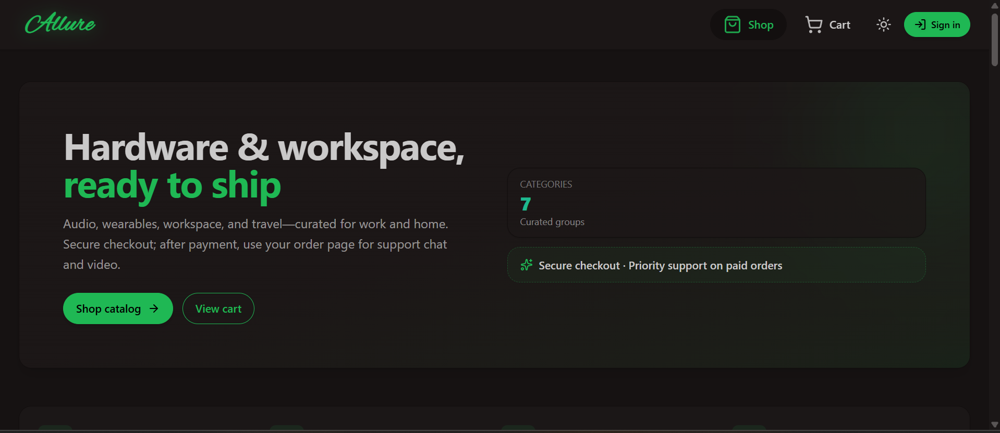
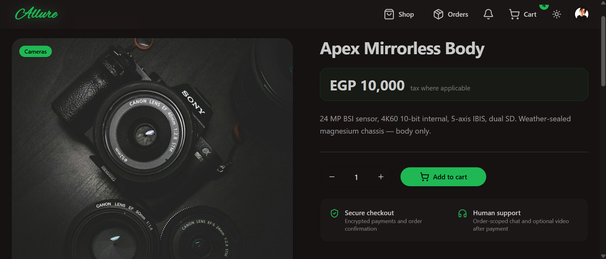

# Allure

[](https://github.com/amiramostafaemam/Allure/actions/workflows/ci.yml)
[](#license)

A full-stack e-commerce platform with authenticated checkout, an admin product dashboard, and post-purchase support via live chat and video calls.

## Screenshots

|                                                        |                                                          |
| ------------------------------------------------------ | -------------------------------------------------------- |
| <br>Shop              | <br>Product page |
| <br>Checkout  | <br>Admin dashboard |
| <br>Order support chat | <br>Light mode |

## Features

- **Catalog & cart** — browsable product catalog with category filters, a persisted cart (Zustand), and per-product pages with customer reviews.
- **Checkout** — server-priced checkout sessions via [Polar](https://polar.sh), with idempotent, signature-verified webhook fulfillment and percentage-based promo codes.
- **Orders** — order history and detail pages for customers, with friendly order numbers; staff/admin views for every order with inline status controls and grouped, real-time notifications.
- **Admin dashboard** — create/edit/deactivate products with image upload to ImageKit, manage categories and promo codes, and change customer roles.
- **Support chat & video calls** — once an order is paid, the customer and support staff get a dedicated Stream Chat channel; staff can drop a one-tap video call invite into it.
- **Wishlist & saved addresses** — save products for later with optimistic-update heart toggles, and save shipping addresses for faster repeat checkout (first save becomes the default automatically).
- **Auth** — Clerk-backed sign-in, with roles (`customer` / `support` / `admin`) synced into the local database via Clerk webhooks.
- **Light/dark mode** — a theme toggle with the brand accent carried across both palettes, persisted per visitor.
- **SEO & installable** — server-rendered Open Graph/Twitter previews per product (real title/description/photo, not the generic sitewide fallback), and a PWA manifest for "Add to Home Screen."
- **Admin analytics** — a dashboard with a revenue trend, order-status mix, and top-products charts, alongside the product/category/customer/promo-code management screens.
- **Observability** — Sentry error tracking and performance monitoring on both the API and the browser, with session replay input/text masking left on for privacy.

## Tech stack

| Layer     | Stack                                                                 |
| --------- | ---------------------------------------------------------------------- |
| Frontend  | React 19, Vite, React Router, TanStack Query, Zustand, Tailwind + daisyUI |
| Backend   | Express 5, TypeScript, Drizzle ORM, PostgreSQL, Zod                   |
| Auth      | Clerk                                                                 |
| Payments  | Polar (hosted checkout + webhooks)                                    |
| Chat/video| Stream Chat & Stream Video                                            |
| Images    | ImageKit                                                              |
| Ops       | Sentry, Docker (single-image monolith build)                          |

## Architecture

The app ships as a single Docker image: Vite builds the SPA to static assets, which the Express server serves alongside its `/api/*` routes and `/webhooks/*` endpoints (see [Dockerfile](Dockerfile)). Locally, the frontend (port 5173) and backend (port 3001) run as two separate dev servers.

Key backend design points worth calling out:

- **Pricing is server-trusted.** The client sends product IDs and quantities; the backend re-fetches prices from the database and computes the total itself ([backend/src/lib/pricing.ts](backend/src/lib/pricing.ts)) — the client never dictates a price.
- **Webhooks are signature-verified** for both Clerk ([backend/src/webhooks/clerk.ts](backend/src/webhooks/clerk.ts)) and Polar ([backend/src/webhooks/polar.ts](backend/src/webhooks/polar.ts)), and checkout fulfillment uses a row-locked transaction with an idempotency check so a retried webhook can't double-fulfill an order.
- **Authorization is enforced server-side**, not just hidden in the UI: admin routes require an admin role ([backend/src/controllers/adminController.ts](backend/src/controllers/adminController.ts)), and order access checks ownership before returning data.

## Getting started

### Prerequisites

- Node.js 22+
- A PostgreSQL database
- Accounts/API keys for Clerk, Polar, Stream, and ImageKit (Sentry is optional)

### Backend

```bash
cd backend
npm install
cp .env.example .env   # fill in your own values
npm run db:push        # apply the schema
npm run db:seed        # optional: seed sample products
npm run dev             # http://localhost:3001
```

### Frontend

```bash
cd frontend
npm install
cp .env.example .env   # fill in your own values
npm run dev             # http://localhost:5173
```

### Useful scripts

| Command (run inside `backend/` or `frontend/`) | What it does          |
| ------------------------------------------------ | ---------------------- |
| `npm run dev`                                    | Start the dev server   |
| `npm run build`                                  | Production build       |
| `npm run lint`                                   | ESLint                 |
| `npm test`                                       | Run the test suite (Vitest) |

### End-to-end tests

A Playwright suite in [e2e/](e2e/) runs against a real instance of the app (no mocks — real Clerk, real Polar, real database) and covers the guest shopping flow: browsing, adding to cart, and the sign-in gate on checkout. See [e2e/README.md](e2e/README.md) for what it deliberately doesn't cover (completing a real purchase) and why.

```bash
cd e2e
npm install
npx playwright install chromium   # first time only
npm test
```

### Docker

```bash
docker build -t allure --build-arg VITE_CLERK_PUBLISHABLE_KEY=pk_test_... .
docker run -p 3001:3001 --env-file backend/.env allure
```

## Security notes

- CORS is restricted to `FRONTEND_URL`, and the API is behind `helmet` and per-route rate limiting.
- `req.params` UUIDs are validated before hitting the database.
- `.env` files are gitignored at both the repo root and inside `frontend/`; only `.env.example` templates are committed.

## License

ISC
